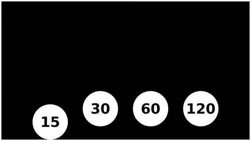
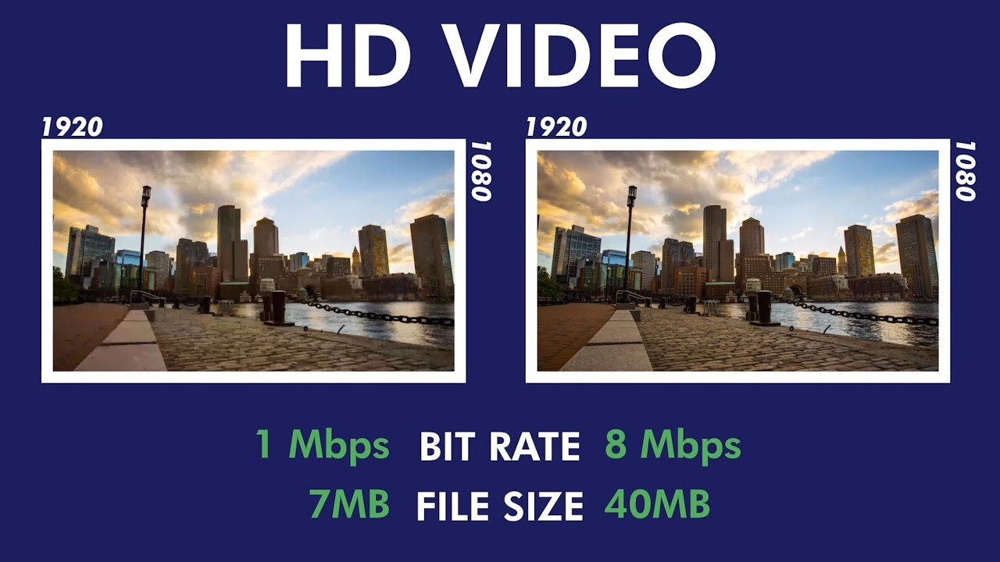

# How Streaming Works

## Terminology

### 1. Resolution
---

Resolution is a measure used to describe the sharpness and clarity of an image or picture.

Video Resolution in essence is the total number of pixels in a given video frame rate. The higher the number of pixels in a given frame, the better the quality of the video.

| HD (High Definition)       | 720p        | 16:9  | 1280 x 720  |
|----------------------------|-------------|-------|-------------|
| Full HD (FHD)              | 1080p       | 16:9  | 1920 x 1080 |
| 2K video (Quad HD)         | 2k or 1440  | 16:9  | 2560 x 1440 |
| 4K video or Ultra HD (UHD) | 4K or 2160p | 1:1.9 | 3840 x 2160 |
| 8K video or Full Ultra HD  | 8K or 4320p | 16∶9  | 7680 x 4320 |

### 2. Frame Rate
---
Number of images shown per second is called FPS or Frame rate per second.

Most people can see about 30-60 fps.

### Codec and Container
---

1. Codec : A video codec is a software that compresses and decompresses digital video.In the context of video , a vide codec applies alogorithm to compress video files into a container format.When its needs to view the codec decompress that 🔥.

2. Container : The container or format stored the audio, video, subtitles and other elements that make up your video.Its all about the end product.

### Common Codecs and supported containers

| Codec name (short) | Full codec name               | Container support    |
|--------------------|-------------------------------|----------------------|
| AV1                | AOMedia Video 1               | MP4, WebM            |
| AVC (H.264)        | Advanced Video Coding         | 3GP, MP4             |
| H.263              | H.263 Video                   | 3GP                  |
| HEVC (H.265)       | High Efficiency Video Coding  | MP4                  |
| MP4V-ES            | MPEG-4 Video Elemental Stream | 3GP, MP4             |
| MPEG-1             | MPEG-1 Part 2 Visual          | MPEG, QuickTime      |
| MPEG-2             | MPEG-2 Part 2 Visual          | MP4, MPEG, QuickTime |
| Theora             | Theora                        | Ogg                  |
| VP8                | Video Processor 8             | 3GP, Ogg, WebM       |

### Bitrate
---

Amount of data encoded per second in a video.Higher the bitrate of the video higher the quality would be and larger the size.

## HTTP Live Streaming (HLS)

HLS is a protocol to cope up with `Adaptive Bitrate Streaming`.
Adaptive Bitrate Streaming adjust video quality based on network conditions to improve video streaming over HTTP networks.This makes playback as smooth as possible for viewers.

`HLS` is one of the streaming protocol thats supports `Adaptive Bitrate Streaming`

`HLS` encode video in segments mostly sizes in seconds or so in diffrent bitrates/resolution/FPS like 720p or 1080p.and have a manifesto file with `.m3u8` extension and the files with `.ts` extension.

Then the video player on user ends decides depending network and CPU condtions what file to full from the `media streaming server` 

This protocol was developed by Apple 2009.

